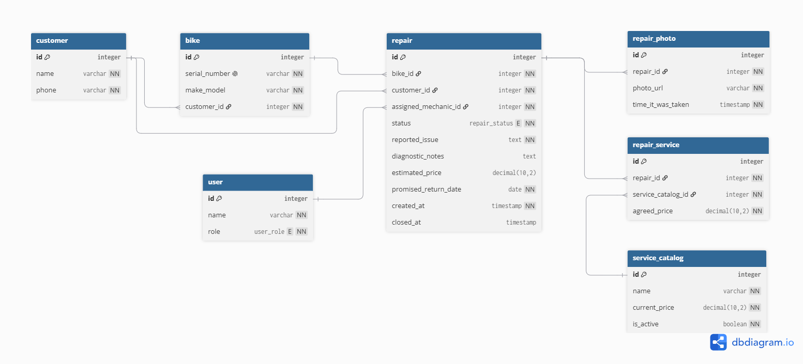

# Domain Model



## Code

```
Enum repair_status {
  arrived
  pending_approval
  approved
  declined
  in_progress
  completed
  closed
}

Enum user_role {
  counter_clerk
  mechanic
  shop_owner
}

Table customer {
  id integer [pk, increment]
  name varchar [not null]
  phone varchar [not null]
}

Table bike {
  id integer [pk, increment]
  serial_number varchar [not null, unique]
  make_model varchar [not null]
  customer_id integer [not null, ref: > customer.id]
}

Table user {
  id integer [pk, increment]
  name varchar [not null]
  role user_role [not null]
}

Table service_catalog {
  id integer [pk, increment]
  name varchar [not null]
  current_price decimal(10,2) [not null]
  is_active boolean [not null, default: true]
}

Table repair {
  id integer [pk, increment]
  bike_id integer [not null, ref: > bike.id]
  customer_id integer [not null, ref: > customer.id]
  assigned_mechanic_id integer [not null, ref: > user.id]
  status repair_status [not null, default: 'arrived']
  reported_issue text [not null]
  diagnostic_notes text
  estimated_price decimal(10,2)
  promised_return_date date [not null]
  created_at timestamp [not null]
  closed_at timestamp
}

Table repair_photo {
  id integer [pk, increment]
  repair_id integer [not null, ref: > repair.id]
  photo_url varchar [not null]
  time_it_was_taken timestamp [not null]
}

Table repair_service {
  id integer [pk, increment]
  repair_id integer [not null, ref: > repair.id]
  service_catalog_id integer [not null, ref: > service_catalog.id]
  agreed_price decimal(10,2) [not null]
}
```

# The thing or the copy of the thing
The mix-up the owner has in March is that they got to identical bikes and they couldnt figure out which was from one owner or the other one. So my model solves this by making every bike a separate entity with its own id and customer_id, so that when you search for a bikes serial or the bikes id, you get the customers id and then its contact information. 

A quantity column (in for example a currently worked on bikes), would fail to solve the problem beucase you will not have a way of identifying the owner of the bike, and so inevitably mix-up two identical looking bikes.

# Derived or Stored?
In my schema i dont have the "total price" of a repair, beaucase this can be derived by the sum of all agreed prices that are asociated with the repair_services line items (the price of repairs list)

Also in my schema as i mentioned, i have an "agreed_price" that may as well be derived or changed in the process of paying, but it gets stored in the repair anyway so that if the service_catalog updates, it doesnt change the value in the repair, locking the price for all past repairs made