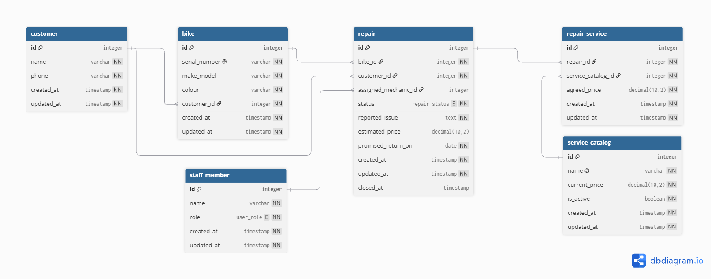

# Domain Model



## Code

```DBLM
Enum repair_status {
  arrived
  pending_approval
  approved
  declined
  in_progress
  completed
  closed
}

Enum user_role {
  counter_clerk
  mechanic
  shop_owner
}

Table customer {
  id integer [pk, increment]
  name varchar [not null]
  phone varchar [not null]
  created_at timestamp [not null]
  updated_at timestamp [not null]
}

Table bike {
  id integer [pk, increment]
  serial_number varchar [not null, unique]
  make_model varchar [not null]
  colour varchar [not null]
  customer_id integer [not null, ref: > customer.id]
  created_at timestamp [not null]
  updated_at timestamp [not null]
}

Table staff_member {
  id integer [pk, increment]
  name varchar [not null]
  role user_role [not null]
  created_at timestamp [not null]
  updated_at timestamp [not null]
}

Table service_catalog {
  id integer [pk, increment]
  name varchar [not null, unique]
  current_price decimal(10,2) [not null]
  is_active boolean [not null, default: true]
  created_at timestamp [not null]
  updated_at timestamp [not null]
}

Table repair {
  id integer [pk, increment]
  bike_id integer [not null, ref: > bike.id]
  customer_id integer [not null, ref: > customer.id]
  assigned_mechanic_id integer [ref: > staff_member.id]
  status repair_status [not null, default: 'arrived']
  reported_issue text [not null]
  estimated_price decimal(10,2)
  promised_return_on date [not null]
  created_at timestamp [not null]
  updated_at timestamp [not null]
  closed_at timestamp
}

Table repair_service {
  id integer [pk, increment]
  repair_id integer [not null, ref: > repair.id]
  service_catalog_id integer [not null, ref: > service_catalog.id]
  agreed_price decimal(10,2) [not null]
  created_at timestamp [not null]
  updated_at timestamp [not null]
}
```

## The thing or the copy of the thing

The mix-up the owner has in March is that they got to identical bikes and they couldnt figure out which was from one owner or the other one. So my model solves this by making every bike a separate entity with its own id and customer_id, so that when you search for a bikes serial or the bikes id, you get the customers id and then its contact information. 

A quantity column (in for example a currently worked on bikes), would fail to solve the problem beucase you will not have a way of identifying the owner of the bike, and so inevitably mix-up two identical looking bikes.

## Derived or Stored?

In my schema i dont have the "total price" of a repair, beaucase this can be derived by the sum of all agreed prices that are asociated with the repair_services line items (the price of repairs list)

In my schema as i mentioned, i have an "agreed_price" that may as well be derived or changed in the process of paying, but it gets stored in the repair anyway so that if the service_catalog updates, it doesnt change the value in the repair, locking the price for all past repairs made

In repair i have the columns of "customer_id" and "bike_id", ion which the first one could be obtained from the "bike" table by its customer_id, but it gets stored here also to separate which customer made the repair and which is the owner, because if the bike changes owner, the repair will be still associated to the past owner of it, but also to the bike itself for the new owner to have that information

## Changes since Lab 3

Since lab 3 there were changes made to the domain model such us:

- The table "repair_photo" has been eliminated because photos were not permited for this lab and every table needs to be in the schema
- The columns "diagnostic_notes" was removed because it was not allowed for this lab
- The column "colour" was added to the bike table to improve distinction and follow the user stories clearly
- "User" table was renamed to "Staff_member" table for better understanding
- The "created_at" and "updated_at" were added to all the tables as part of the assignment
- Assigned mechanic was made "Nullable" because for one to be assigned to a job first the bike needs to pass the state of "approved" before it can be worked on, still is a reference that indicates that the mechanic has to exist in the shop to be on the repair
- In "service_catalog" the "name" column was made unique as per the example in the assignment
- Added another "derived or stored?" entry
