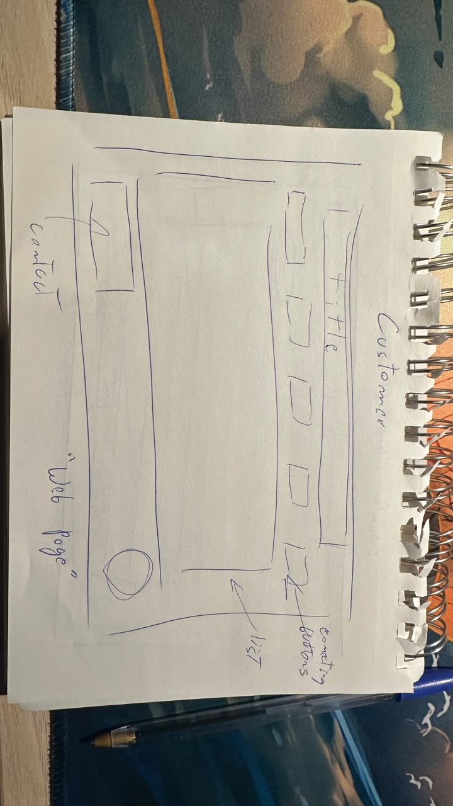
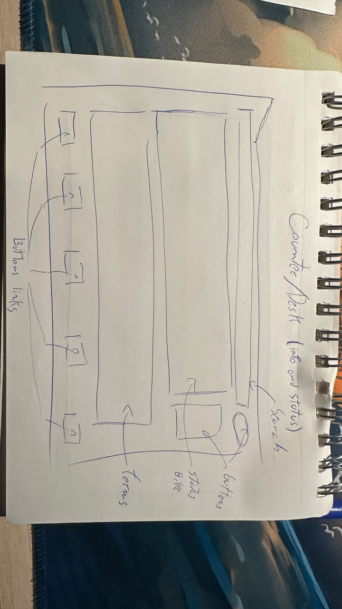
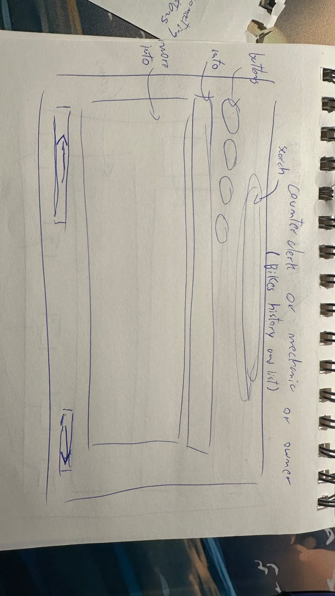
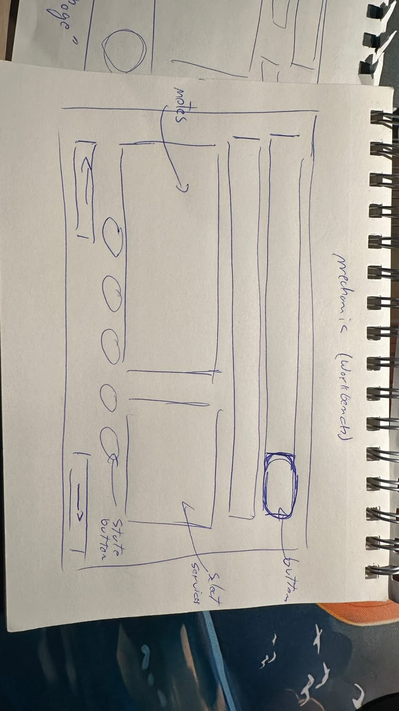
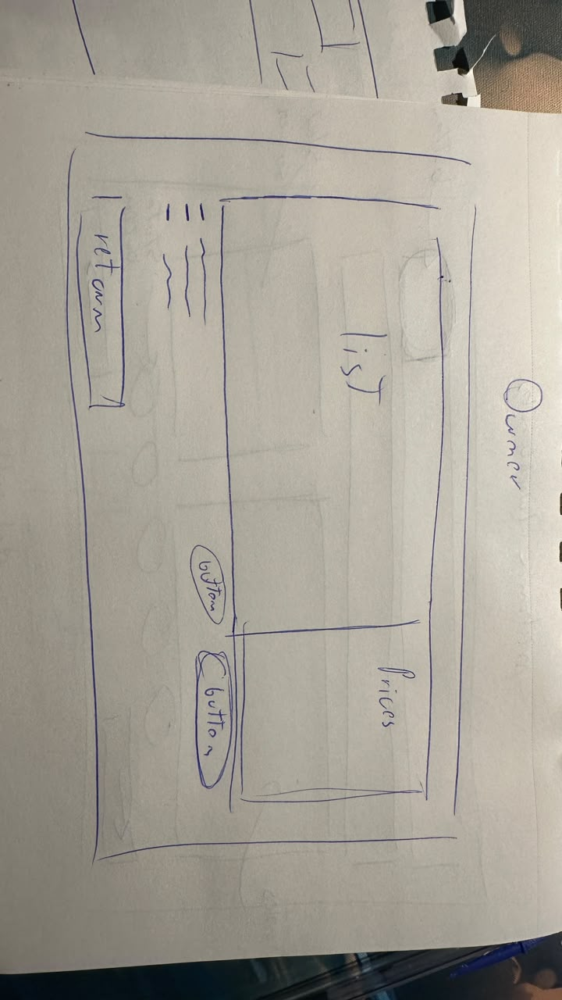
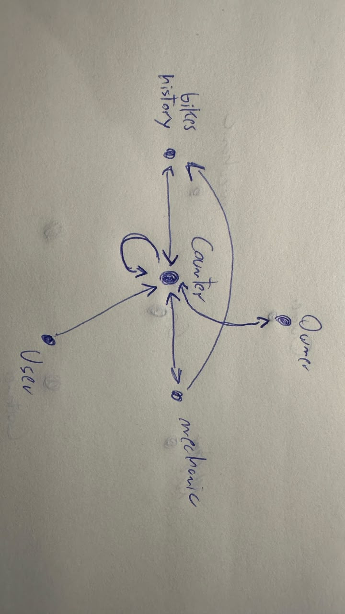

### Screen 1: Public Price Catalog & Services
**Role:** Customer  

---

### Screen 2: Counter Intake, Status Lookup & Handover
**Role:** Counter Clerk  

---

### Screen 3: All Bikes Master Registry & History
**Role:** Any shop worker  

---

### Screen 4: Workshop Queue & Mechanic Workbench
**Role:** Mechanic  

---

### Screen 5: Service Price Catalog Management
**Role:** Business Owner  

---

## System Navigation Graph
